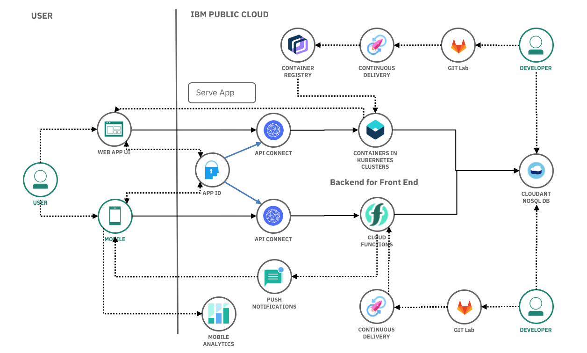
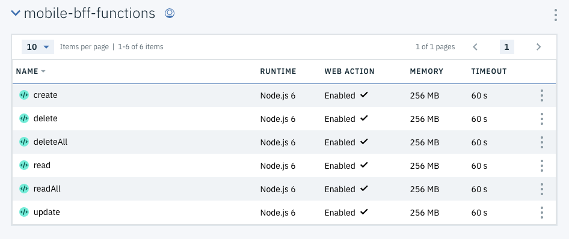
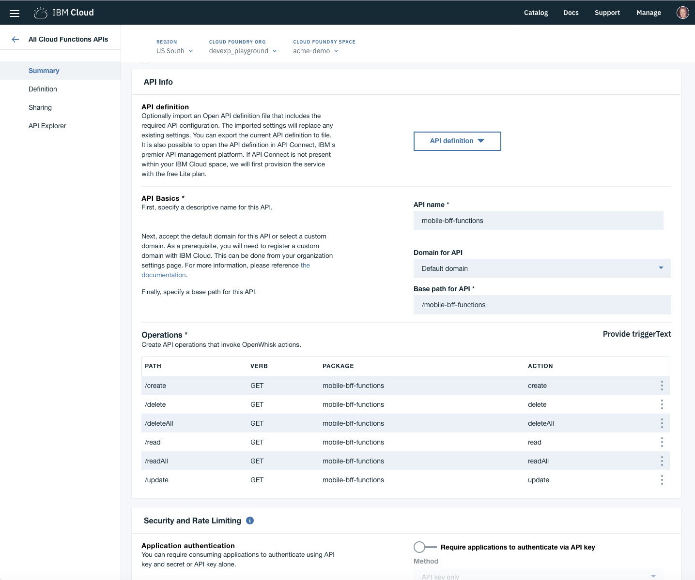

---

copyright:
  years: 2017, 2018
lastupdated: "2017-06-12"

---
{:new_window: target="_blank"}
{:shortdesc: .shortdesc}
{:screen: .screen}
{:codeblock: .codeblock}
{:pre: .pre}

# Creating serverless iOS Apps
{: #functions_ios}

What is serverless? The serverless development pattern refers to application development where server-side logic is run in stateless containers. The executions are event-triggered, ephemeral (lasting for a single execution), and fully managed by a third party. This paradigm known as Functions as a Service (FaaS), is where the developer provides a stateless function that can be triggered, and executed without explicitly provisioning or managing a server.

By abstracting away the infrastructure and frameworks necessary for server-side development, serverless architecture allows developers to focus on building applications to run reactively to change data.

IBM's FaaS offering, {{site.data.keyword.openwhisk}}, strives to provide a seamless, server-side development experience without needing any specialized server-side knowledge. By leveraging this technology, you can quickly develop scalable backend solutions to meet practically any workload demand without the need to provision resources ahead of time. For applications that have unpredictable load patterns, or high server down time, the {{site.data.keyword.openwhisk_short}} solution offers improved performance, and its "pay for what you use" system helps to decrease costs.

## Using Cloud Functions with iOS Apps

The Apple Development console contains a starter kit that accelerates the creating a set of serverless actions that can help get an iOS developer up and running, including server-side logic, and data integration. 

The Apple Console has a starter named *Functions with Data*, that supports the CRUD (Create, Read, Update, Delete) pattern. 

These actions help you easily bind to a Cloudant NoSQL Database. {{site.data.keyword.openwhisk_short}} Actions are then used in an API Connect API that can be used to manage authentication, traffic limits, and provide an integration point for an iOS app.

The benefit of using serverless technology and API Connect, is that it is easy to consume these APIs inside the Swift iOS App. The API is automatically created into a Swift native SDK (Software Development Kit) binding source code, that can then be used to invoke the backend logic. 

You can then iterate and evolve the backend logic and can use the `ibmcloud sdk` CLI command to re create a new SDK binding to the API that you are evolving. This model of working between a client app and a backend app, follows the common principles of aligning a backend for front end model to your application solution. 

See the following example application architecture, that can be achieved by using the two backend logical models the Apple Development console supports. 



The starter kit also creates a DevOps toolchain that manages the source code, and deployment of the actions into the {{site.data.keyword.openwhisk_short}} name spaces. An API is automatically created, and maps the actions into the API for you. This workflow for {{site.data.keyword.openwhisk_short}} enables Cloud Native management to be added around the workflow of releasing new code changes to the {{site.data.keyword.openwhisk_short}} actions.

## CRUD Pattern

The CRUD (Create, Read , Update, Delete ) pattern is a common backend logic pattern, that is used enable the creation of database documents, updating documents, and the final deletion of the documents in the database. 

The following actions are created, and each action can be managed separately by using the DevOps flow. 

```swift
create.swift
delete.swift
deleteAll.swift
read.swift
readAll.swift
update.swift
```

The actions are then registered into the {{site.data.keyword.openwhisk_short}} area, and can be access through the `Menu -> Functons`.



## API Definition

The {{site.data.keyword.openwhisk_short}} actions are defined into an API that is managed by the {{site.data.keyword.cloud_notm}} platform. You can access the definition through the `Menu -> Functions -> API` menu options, where you can select the API that was created. 

The definition can be customized to support Rate limiting for calls from your iOS app and managing the security definition. 



<!--
## Managing your iOS app

Once you have created your Functions App, you can manage it with the cloud.

(Andy T can you add in screen shots and Deploy to Functions button instructions and info on the Tool Chain etc etc)

Some information about how it works etc and wskdeploy, also about git clone and running ibmcloud wsk deploy from CLI etc. Maybe link to the Electron tool.

(Andy T) to add some content here
-->

## Consuming the API in your iOS App

To consume the API in your iOS App, see the [Adding an API to iOS apps](api/api.html) topic where you can learn how to invoke backend APIs from your iOS Swift App, and consume the responses in your app.

## Summary

By using the **Functions for Data** starter kit, you can easily set up {{site.data.keyword.openwhisk_short}} actions that can be consumed for integrating data into your application. This configures and sets up an API to manage the external access to your {{site.data.keyword.openwhisk_short}}. The API can then be used to manage security and rate limiting for consumers. For more information, see [API Management](https://console.bluemix.net/docs/services/apiconnect/index.html#index). 