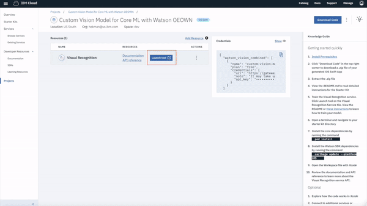
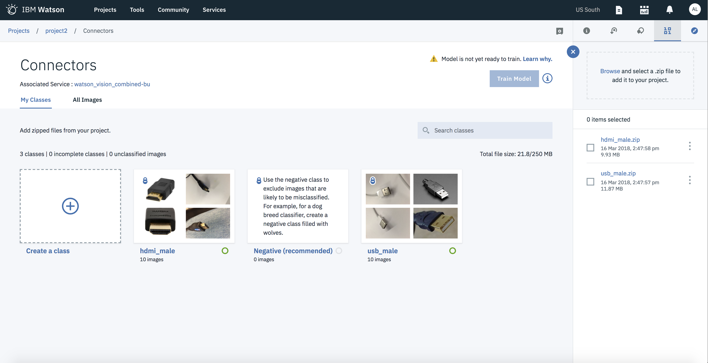

---

copyright:
  years: 2018, 2020
lastupdated: "2020-02-27"

keywords: coreml swift, core ml swift, watson swift core, create model swift, image classification swift, version parameter swift, swift coreml watson

subcollection: swift

---

{:tip: .tip}
{:new_window: target="_blank"}
{:shortdesc: .shortdesc}
{:screen: .screen}
{:codeblock: .codeblock}
{:pre: .pre}
{:gif: data-image-type='gif'}
{:external: target="_blank" .external}

# Using Core ML with Watson
{: #swift-coreml}

With [Core ML](https://developer.apple.com/documentation/coreml){: external}, you can integrate a broad variety of machine learning model types into your app. In addition to supporting extensive deep learning with over 30 layer types, it also supports standard models such as tree ensembles, SVMs, and generalized linear models. Instead of sending data remotely to be analyzed, Core ML uses low-level technologies, such as Metal and Accelerate, to seamlessly take advantage of the CPU and GPU to provide maximum performance and efficiency.

You can add Core ML and Watson Visual Recognition to a Swift application by using the following steps to train and create a model, download and build dependencies, and add image classification.
{: shortdesc}

## Before you begin
{: #prereqs-coreml}

To use Core ML and Watson Visual Recognition with Swift, you need the following components:

* iOS 11.0+
* Xcode 9.3+
* Swift 4.1+
* CocoaPods, Carthage, or Swift Package Manager

You can install the [Watson Swift SDK](https://github.com/watson-developer-cloud/swift-sdk){: external} by using [CocoaPods](https://github.com/watson-developer-cloud/swift-sdk#cocoapods){: external}, [Carthage](https://github.com/watson-developer-cloud/swift-sdk#carthage){: external}, or the [Swift Package Manager](https://github.com/watson-developer-cloud/swift-sdk#swift-package-manager){: external}. By using CocoaPods to manage dependencies, you get only the frameworks that you need, as opposed to the entire Watson Swift SDK. If you are new to CocoaPods, you can install it easily:

```sh
sudo gem install cocoapods
```
{: pre}

## Step 1. Training a model with {{site.data.keyword.watson}} {{site.data.keyword.visualrecognitionshort}}
{: #train-module-coreml}

If a current model does not exist, the first model that is discovered remotely, or any one that exists locally is used. The following gif and accompanying instructions show you how to link your service to Watson Studio and train your model.



### Setting up the service from your Core ML App dashboard
{: #service-coreml}

1. Start the Visual Recognition Tool from your Starter Kit's dashboard by selecting **Launch Tool**.
2. Begin creating your model by selecting **Create Model**.
2. If a project is not yet associated with the Visual Recognition instance that you created, a project is created. Otherwise, skip to the **Create Model** section.
3. Name your project, and click **Create**.
  
  If no storage is defined, click refresh.
  {: tip}

### Binding a Service to a Project
{: #bind-service-coreml}

1. After you create your project, the project dashboard is displayed.
2. Go to the settings tab, scroll down to **Associated Services**, select **Add Service** -> **Watson**.
3. From the Watson services page, select **Visual Recognition**.
4. Select the **Existing** tab on the service info page, and then select your service instance from the dashboard.
5. Now that your service is bound, you can begin creating your model by selecting **Assets** from your Project dashboard, and then clicking **Add Visual Recognition Model**.

### Creating a Model
{: #create-model-coreml}

1. From the model creation tool, you can update the classifier name. If you would like to use a specific model, make sure to modify the `defaultClassifierID` field in main View Controller.

2. From the sidebar, upload the model training courses in compressed `.zip` files. Then, select each data set and add them to your model from the drop-down menu. Feel free to add more classes that use your own image sets to enhance the classifier!

{: caption="Figure 1. Link service to Watson Studio" caption-side="bottom"}

3. Select **Train Model**, and then wait for the model to be fully trained.

You're all set! Now, you're ready to download your Core ML model and integrate it into your app by using the [Watson Developer Cloud Swift SDK](https://github.com/watson-developer-cloud/swift-sdk){: external}.

## Step 2. Downloading and building dependencies
{: #install-depend-coreml}

Using your favorite text editor, create a new `Podfile` in the root directory of your project (where your `.xcodeproj` file is located) by running `pod init`. Then, add a line to specify the {{site.data.keyword.visualrecognitionshort}} framework of the Watson Swift SDK as a dependency:

```pod
use_frameworks!

target 'MyApp' do
    pod 'IBMWatsonVisualRecognitionV3'
```
{: codeblock}

For a production app, you might also want to specify a particular [version requirement](https://guides.cocoapods.org/using/the-podfile.html#specifying-pod-versions){: external} to avoid unexpected changes from new releases of the Watson Swift SDK.

With your `Podfile` in place, now you can download the dependencies. Use a terminal to navigate to the root directory of your project, then run CocoaPods:

```sh
pod install
```
{: pre}

Cocoapods downloads the {{site.data.keyword.visualrecognitionshort}} framework, and builds it in the `Pods/` folder of your project.

To prevent Pod build failures, open the file that ends in `.xcworkspace` instead of the `.xcodeproj` when you open the project in Xcode.
{: tip}

## Step 3. Adding image classification to your app
{: #add-image-coreml}

The following samples help you add {{site.data.keyword.visualrecognitionshort}} Core ML capabilities to your application, typically in the `ViewController.swift`. Using the following examples, you can extend the local model calls for your use case.

1. Add an import statement for Visual Recognition:
  ```swift
  import VisualRecognition
  ```
  {: codeblock}

2. Pass the API key and version to initialize the SDK:
  ```swift
  let authenticator = WatsonIAMAuthenticator(apiKey: "your-api-key")
  let visualRecognition = VisualRecognition(version: "yyyy-mm-dd", authenticator: authenticator)
  visualRecognition.serviceURL = "{url}"
  ```
  {: codeblock}
  
  Check out the [Authentication section](https://{DomainName}/apidocs/visual-recognition/visual-recognition-v3?code=swift#authentication){: external} for more information about how to configure your service instance with your credentials.
  {: tip}

3. Add the following code to download or update the local Core ML model with your Watson classifier:
  ```swift
  // Name of the classifier to use
  let classifierID = "your-classifier-ID-here"

  // Minimum confidence threshold for image recognition
  let threshold = 0.5

  // Update or download your model
  visualRecognition.updateLocalModel(classifierID: classifierID) { _, error in
      if let error = error {
          print(error)
      } else {
          print("model successfully updated")
      }                
  }
  ```
  {: codeblock}

4. Add the following code to classify an image by using your local Core ML model:
  ```swift
  let image = UIImage(named: "your-image-filename")
  let classifierID = "your-classifier-ID-here"
  let threshold = 0.5

  // Classify your image using your model                                         
  visualRecognition.classifyWithLocalModel(image: image, classifierIDs: [classifierID], threshold: threshold) { classifiedImages, error in
      if let error = error {
          print(error)
      }
      guard let classifiedImages = classifiedImages? else {
          print("Failed to classify the image")
          return
      }
      print(classifiedImages)
  }
  ```
  {: codeblock}

5. Explore the other [Core ML classification capabilities](https://watson-developer-cloud.github.io/swift-sdk/services/VisualRecognitionV3/index.html){: external} supported by the Watson SDK.

## Step 4. Using starter kits
{: #coreml_starterkits}

With starter kits, you can quickly and easily use the capabilities of {{site.data.keyword.cloud_notm}} and Core ML. You can add {{site.data.keyword.visualrecognitionshort}} to any client iOS app or server-side back end by using the starter kits. The Custom Vision Model for Core ML with {{site.data.keyword.watson}} Starter Kit illustrates how to create a custom {{site.data.keyword.visualrecognitionshort}} model, and instantiate it as a Core ML model that you can run locally on your device.

To add {{site.data.keyword.visualrecognitionshort}} to a starter kit, complete the following steps:

1. Select the [starter kit](https://{DomainName}/developer/appledevelopment/starter-kits){: external} with which you want to work.
2. Create the app with the default services.
3. Click **Add service > Watson > {{site.data.keyword.visualrecognitionshort}}**.
4. Download the project by clicking **Download code**. For iOS projects, the credentials are inserted in the `BMSCredentials.plist` file in the corresponding key fields. For server-side Swift projects, you can find these credentials in the `config/local-dev.json` file.

## Next steps
{: #coreml_next}

Now you can analyze images by using your own custom-generated Core ML models. Keep the momentum by trying one of the following options:

* Check out the [{{site.data.keyword.watson}} Swift SDK](https://github.com/watson-developer-cloud/swift-sdk){: external} and explore the other supported Watson services.
* Add cloud logic. Start with [developing serverless apps](/docs/swift/backend?topic=swift-serverless-dev-swift#serverless-dev-swift).
* Take advantage of all the features that {{site.data.keyword.visualrecognitionshort}} offers. See the [documentation](/docs/services/visual-recognition?topic=visual-recognition-index#index) for more details.
